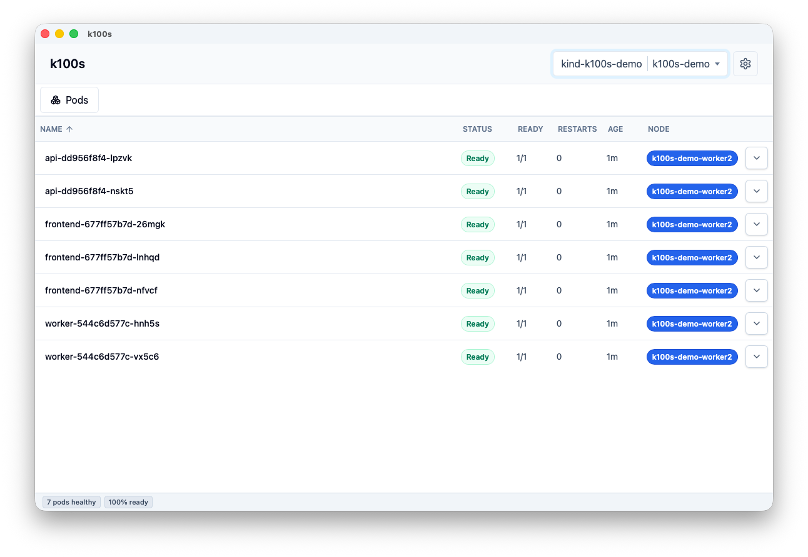
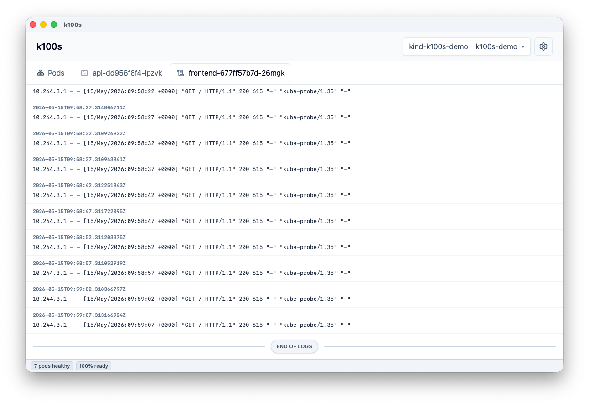
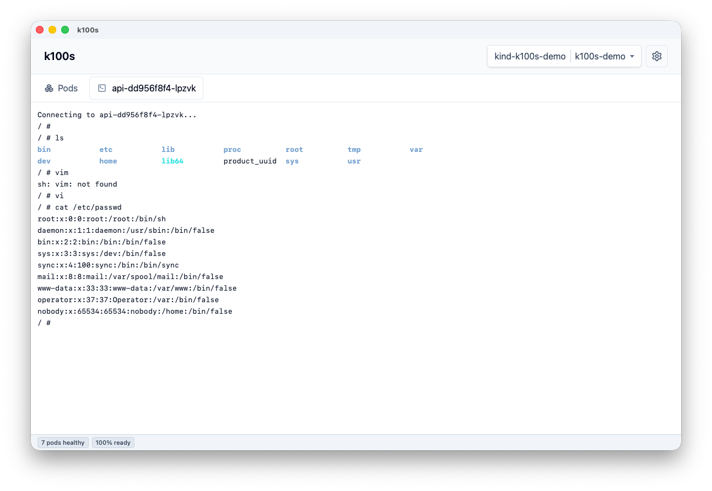
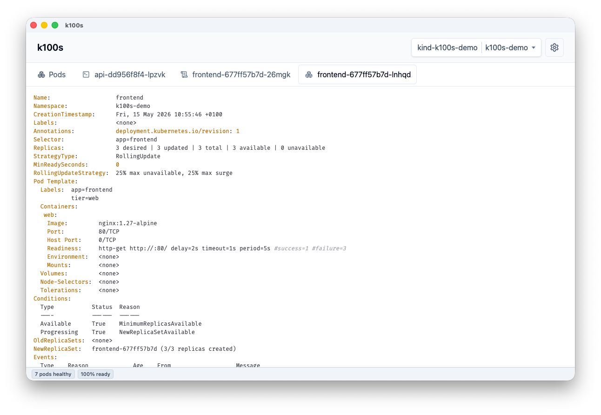
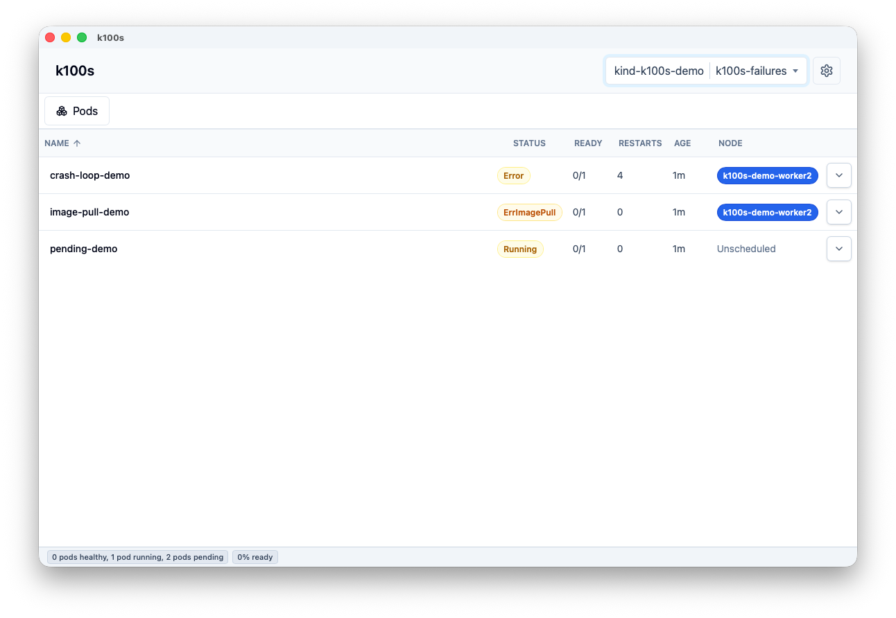

# k100s

A small Tauri desktop app for browsing Kubernetes contexts, namespaces, pods, logs, and pod descriptions.

## Screenshots











## Install

```sh
brew install --cask andrewvos/tap/k100s
```

If macOS says `"k100s" is damaged and can't be opened`, remove the quarantine flag:

```sh
xattr -dr com.apple.quarantine /Applications/k100s.app
```

## Requirements

- [Bun](https://bun.sh/)
- [Rust](https://www.rust-lang.org/tools/install)
- `kubectl` installed and available on your `PATH`
- A configured kubeconfig with one or more contexts

## Development

```sh
bun install
bun run dev
```

The React renderer runs on `http://127.0.0.1:5173/`, and Tauri loads that URL during development.

Pods refresh automatically every 5 seconds while auto refresh is enabled. The refresh uses `kubectl get pods -o json` through Tauri commands.

## Build

```sh
bun run build
```

The Tauri Rust backend calls `kubectl` directly and exposes commands/events to the renderer.

## Screenshot Demo Cluster

Create a local Kubernetes cluster with sample namespaces, healthy workloads, streaming logs, and a few intentionally unhealthy pods:

```sh
bun run demo:cluster
```

This requires Docker, `kind`, and `kubectl`.

The script writes its kubeconfig to `~/.kube/k100s-demo.kubeconfig` so it can work even if your normal kubeconfig has unrelated YAML issues. Launch k100s with that kubeconfig:

```sh
KUBECONFIG="$HOME/.kube/k100s-demo.kubeconfig" bun run dev
```

Then select the `kind-k100s-demo` cluster. The script creates:

- `k100s-demo` with frontend, API, and worker pods
- `k100s-observability` with log-stream and cache pods
- `k100s-failures` with CrashLoopBackOff, ImagePullBackOff, and Pending examples

Reset or remove the cluster with:

```sh
bun run demo:cluster:reset
bun run demo:cluster:down
```

Releases are created from `main` with:

```sh
bun run release:patch
```

The release workflow builds the macOS DMG, publishes it to GitHub, updates `Casks/k100s.rb`, and syncs the cask to `AndrewVos/homebrew-tap` when `HOMEBREW_TAP_TOKEN` is configured in this repository's GitHub Actions secrets.
